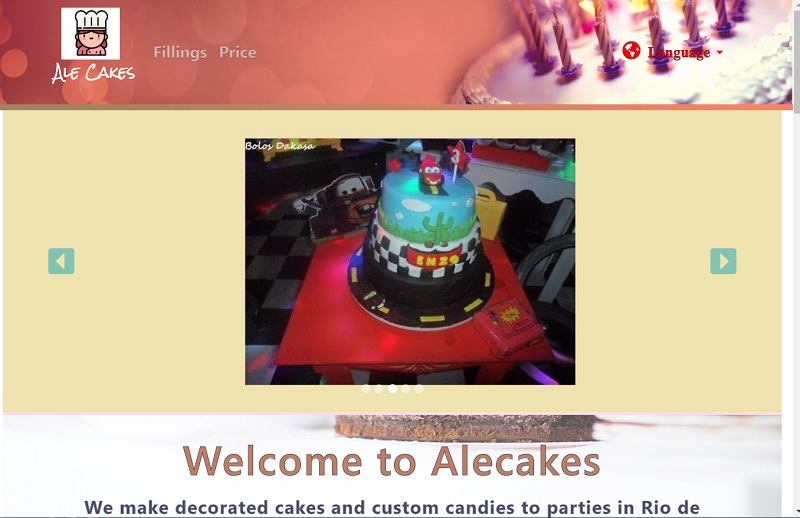
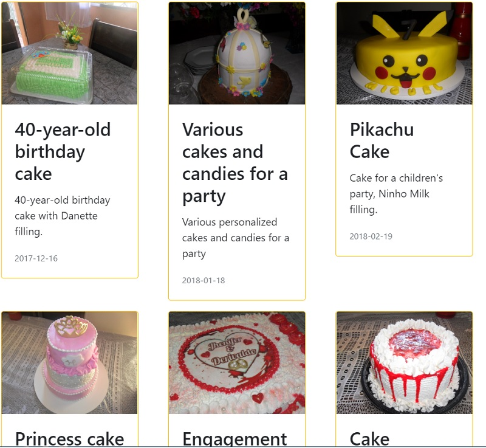
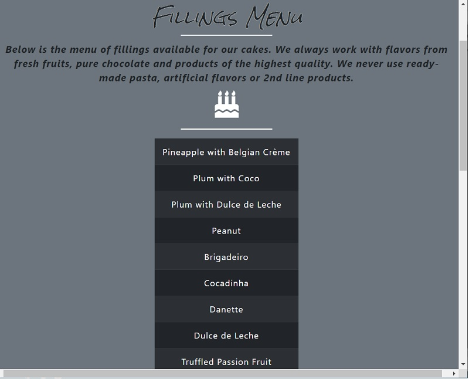

# Alecakes
This is a Laravel project that acts as personal page for a baker. It shows her works, prices and fillings.

It was made using the Framework Laravel, Bootstrap, Jquery and Awesome Icons. It also contains Responsive design, CSS animations, Ajax, sidebar button, language selector, cards, Parallax, Carousel, Google Fonts and others features.

The file <a href="database/model.mwb">database/model.mwb</a> shows how the database was structured using MySQL.

This project contains all the migrations seeders wich have to be made to work properly. For this, you have to configure the .env file and execute:
```
php artisan migrate refresh --seed
```

## Author
* [Elson Ramos](https://github.com/Elson0509)

## Screenshots









